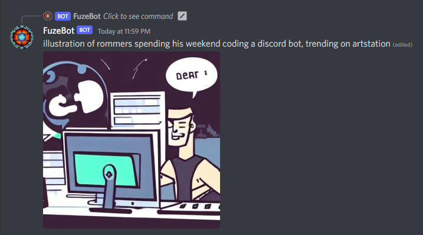

# Discord Diffusion

A self-hosted discord bot running [Stable Diffusion 1.4](https://huggingface.co/CompVis/stable-diffusion-v1-4).

## Setup

1. Get a discord bot token, connect it to your server. TODO: document
2. Get a huggingface token. TODO: document
3. Run the docker image [jamesrom/discord-diffusion:latest](https://hub.docker.com/r/jamesrom/discord-diffusion)

Example:
```bash
docker run --rm -it --gpus=all \
    --volume $PWD\huggingface:/home/huggingface/.cache/huggingface \
    --volume $PWD\output:/home/huggingface/output \
    --env DISCORD_TOKEN=$BOT_TOKEN_HERE> \
    --env HUGGINGFACE_TOKEN=$HF_TOKEN_HERE \
    jamesrom/discord-diffusion:latest
```

## Configuration

Configure by environment variables:

| Variable        | Default | Description                               |
| --------------- | ------- | ----------------------------------------- |
| `DISCORD_TOKEN` *required* | — | Discord token. |
| `HUGGINGFACE_TOKEN` *required* | — | Huggingface token. |
| `DEFAULT_HEIGHT` | `512` | Must be divisible by 8. |
| `DEFAULT_SEED` | Random | Set the default seed for reproducibility. Must be an integer. |
| `DEFAULT_WIDTH` | `512` | Must be divisible by 8. |
| `FILE_FORMAT` | `jpeg` | Must be `jpeg` or `png`. |
| `MAX_COUNT` | `5` | Set the maximum number of generated images per command. If set to 1, will disable the command option altogether. |
| `MAX_HEIGHT` | `2048` | Maximum height of generated images. |
| `MAX_WIDTH` | `2048` | Maximum width of generated images. |
| `NSFW_GLOBAL_ENABLE` | `false` | Bypass the built-in safety check globally. |
| `NSFW_IN_AGE_RESTRICTED_CHANNELS` | `true` | Disable the safety check only in [Age-Restricted Channels](https://support.discord.com/hc/en-us/articles/115000084051-Age-Restricted-Channels-and-Content). |
| `NSFW_USER_OVERRIDE` | `false` | Allow the user to disable the safety check with the `nsfw` command option. |
| `SAVE_IMAGE_TO_DISK` | `false` | Whether to save a copy of the generated image to disk. |
| `SD_ATTENTION_SLICING` | `false` | Use less memory at the cost of speed. |
| `SD_MODEL` | `CompVis/stable-diffusion-v1-4` | The huggingface model to download and use. |
| `SD_REVISION` | `main` | The model revision to use. |

### Volume mounts

TODO

## Usage

Type `/text2img` and enter your prompt. Optional parameters can be given:

- `width` - The desired width of the generated image. Must be divisible by 8 and smaller than the configured `MAX_WIDTH`.
- `height` - The desired width of the generated image. Must be divisible by 8 and smaller than the configured `MAX_HEIGHT`.
- `count` - The number of images to generate. If `MAX_IMAGE_COUNT` is 1, this option will be unavailable.
- `nsfw` - Disable the built-in safety check. This option will be unavailable if `GLOBAL_NSFW_ENABLE` is true, or `ALLOW_NSFW_USER_OVERRIDE` is false.



## Memory requirements

At least 8GB recommended. Here's some things you can do if you see memory errors:

1. Set `REVISION=fp16`, this uses half-sized tensors (16 bit instead of 32 bit) and should reduce memory footprint by about half.
2. Enable attention slicing with `ATTENTION_SLICING=true`. This lowers memory requirements at the cost of speed.
3. Lower `DEFAULT_WIDTH` and `DEFAULT_HEIGHT`, similarly `MAX_HEIGHT` and `MAX_WIDTH`

## Building from source

Easy:
```sh
docker buildx build . --tag my-cool-bot
```

## Thanks

Thanks to the following prior work for inspiration:

 - [Stable Diffusion in Docker](https://github.com/fboulnois/stable-diffusion-docker)
 - [interactions.py](https://github.com/interactions-py)
